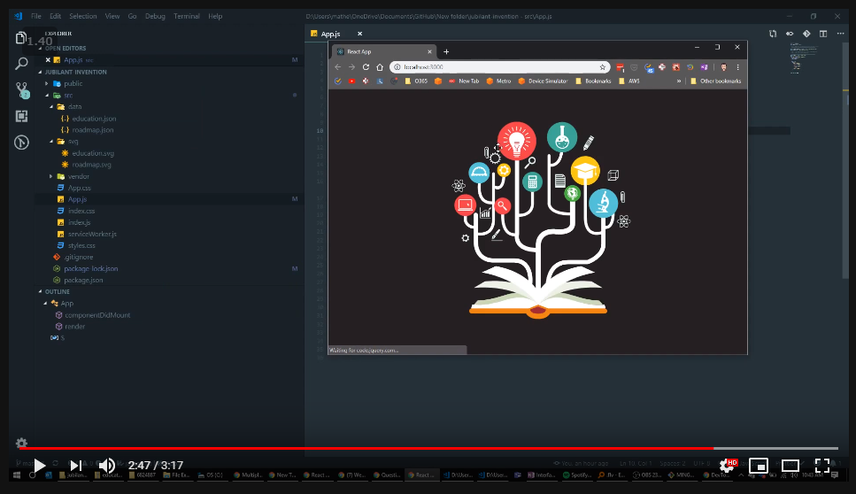
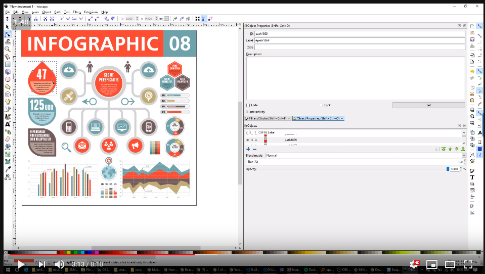

# SVG Web Viewer

**Last Updated:** 2019-05-19

Inspired by [The Tree of Up project ][treeofup]

## 1. Setup - Clone and Run

## 2. Add SVG and JSON

<!-- Reference Links -->

[treeofup]: https://up.com.au/blog/the-tree-of-up/ "The Tree of Up"
